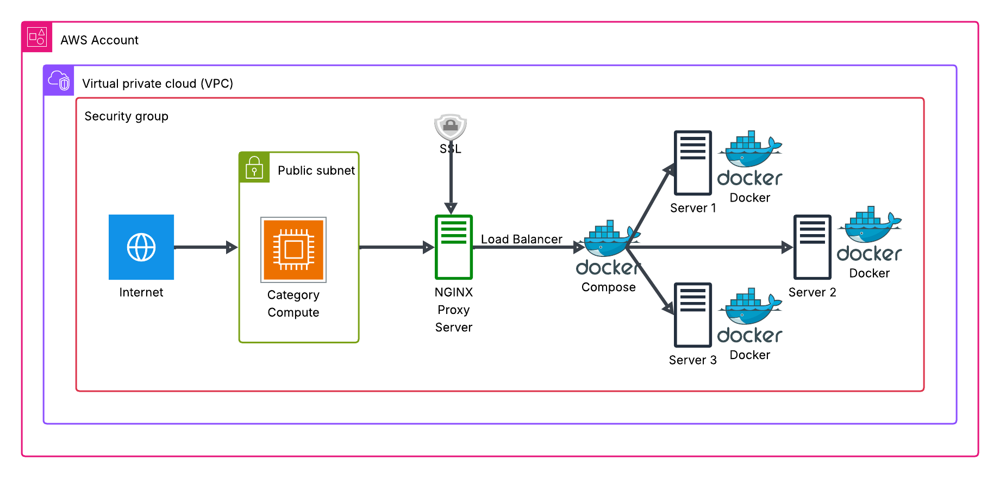

# Nginx Load Balancer with Node.js Apps using Docker

This project demonstrates how to set up an Nginx reverse proxy with SSL, load-balancing multiple Node.js applications running in Docker containers.



## 🧾 Overview

- **Nginx** is configured to:
  - Load balance 3 Node.js apps using `least_conn` strategy
  - Redirect HTTP (port 8080) to HTTPS (port 443)
  - Use a self-signed SSL certificate

- **Docker Compose** is used to:
  - Run 3 instances of a Node.js app on different ports (3001, 3002, 3003)

## 🗂 Structure

- `sample.nginx.conf`: Nginx configuration file
- `Dockerfile`: Builds a simple Node.js app
- `docker-compose.yml`: Spins up 3 app containers

## ⚙️ How to Use

1. **Generate Self-Signed SSL Certificate:**
   ```bash
   openssl req -x509 -nodes -days 365 -newkey rsa:2048 \
   -keyout private.key -out cert.crt


2. **Update `sample.nginx.conf`** with your certificate paths:

   ```nginx
   ssl_certificate cert.crt;
   ssl_certificate_key private.key;
   ```

3. **Start Docker Containers:**

   ```bash
   docker-compose up --build
   ```

4. **Run Nginx (on host machine):**

   ```bash
   sudo nginx -c /path/to/sample.nginx.conf
   ```

## 🌐 Access

* Visit `https://localhost` to see the load-balanced app
* HTTP (`http://localhost:8080`) auto-redirects to HTTPS

---

## 🚀 Optional: Deploy to AWS EC2
You can deploy this Nginx + Dockerized Node.js setup on an EC2 instance inside a public subnet in your VPC.

### 📦 Prerequisites

* AWS account
* VPC with a public subnet
* Security group allowing inbound traffic on ports: 22 (SSH), 8080 (HTTP), 443 (HTTPS)
* EC2 instance (Amazon Linux 2 or Ubuntu) with Docker, Docker Compose, and Nginx installed

### 🛠️ Steps
SSH into your EC2 instance:

```bash
Edit
ssh -i "your-key.pem" ec2-user@your-ec2-public-ip
```

Install Docker & Docker Compose (if not pre-installed):

```bash
# Amazon Linux 2
sudo yum update -y
sudo amazon-linux-extras enable docker
sudo yum install docker -y
sudo service docker start
sudo usermod -aG docker ec2-user
```

# Docker Compose
```bash
sudo curl -L "https://github.com/docker/compose/releases/latest/download/docker-compose-$(uname -s)-$(uname -m)" -o /usr/local/bin/docker-compose
sudo chmod +x /usr/local/bin/docker-compose
```

Install Nginx (on host):

```bash
sudo amazon-linux-extras enable nginx1
sudo yum install nginx -y
```

Clone this repo and navigate into it:

``` bash
git clone https://github.com/yourusername/your-repo.git
cd your-repo
```

Generate SSL certificate (or use your own):


```bash
openssl req -x509 -nodes -days 365 -newkey rsa:2048 \
-keyout private.key -out cert.crt
```

Edit sample.nginx.conf to use the correct SSL cert paths.

Start the Docker containers:

``` bash
docker-compose up --build -d
```

Run Nginx:

``` bash
sudo nginx -c /path/to/sample.nginx.conf
```

Access the app:

* Visit: https://your-ec2-public-ip in your browser

Feel free to customize `server.js` or `index.html` as needed.
